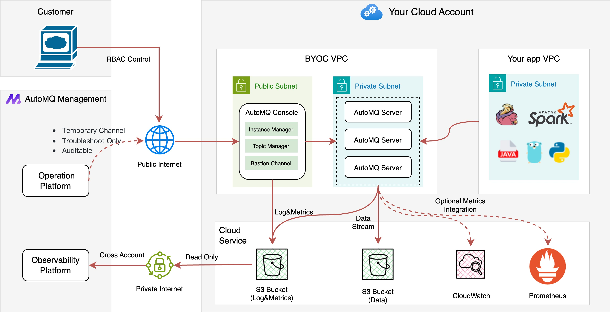
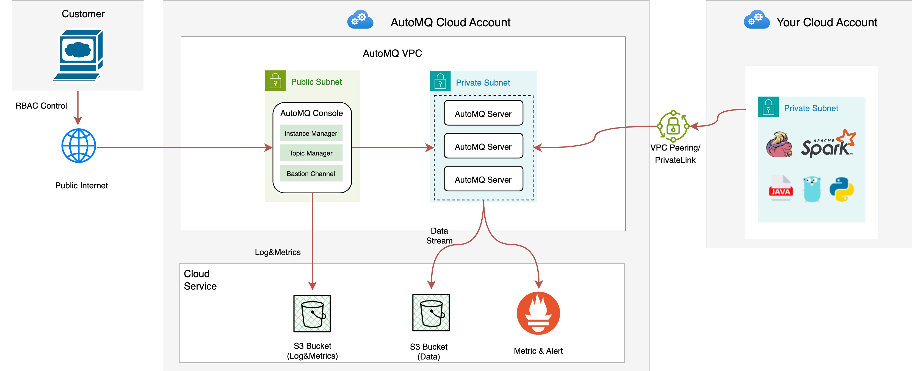

# What Is AutoMQ Cloud

## Overview

AutoMQ Cloud is a next-generation, fully managed Kafka cloud service provided by AutoMQ HK Limited. It enables enterprise developers to easily build and run event stream processing applications in a Public Cloud environment without worrying about cluster operations and maintenance.

AutoMQ Cloud is fully compatible with open-source Apache Kafka and offers significant enhancements and improvements for enterprise-level scenarios such as high availability, disaster recovery architecture, elasticity, and observability operations compared to Apache Kafka.

AutoMQ Cloud supports both SaaS mode and BYOC mode, based on the differences in underlying resource ownership accounts and operation responsibilities. In SaaS mode, users only need to access service endpoints, without concerning themselves with the underlying cloud resources, which are managed by the AutoMQ service provider. In BYOC mode, the software service is deployed in the user's cloud account, ensuring that data does not leave the user's VPC, thus achieving higher privacy protection and data security standards.

For detailed information about the SaaS mode and BYOC mode, refer to [Overview▸](/docs/automq-cloud/manage-environments/overview).

AutoMQ Cloud SaaS Edition

## Core Advantages

AutoMQ Cloud offers the following advantages:

#### Pay-as-you-go, with a 50% Reduction on Cloud Bills

AutoMQ's new cloud-native architecture fully leverages **object storage** and cloud **elastic computing** resources, providing significant cost advantages over Apache Kafka and other competitor solutions.

By enabling AutoMQ Cloud, you can fully utilize resources on demand and pay-as-you-go, with a 50% reduction on cloud bills.

#### Fully Managed, Maintenance-free, with SLA Assurance

AutoMQ Cloud is a fully managed cloud service offered by the AutoMQ Team for Public Cloud environments. Users can start using the service with just one click, without worrying about cluster deployment, changes, or other maintenance operations. The AutoMQ Team provides 24/7 operational support and SLA assurance.

#### Supports BYOC, Resources Deployed in User VPC, No Cross-network Data

In addition to the traditional SaaS model, AutoMQ Cloud also supports the BYOC model, where cloud resources are deployed in the user's VPC. Users can access AutoMQ without cross-network connectivity, and can also utilize existing cloud account resource discounts.

#### Enterprise-Level Capabilities Out of the Box

AutoMQ Cloud enhances the Community Edition with enterprise-level features such as auto-scaling, second-level partition reassignment, and integrated system observability. Users can utilize these enhancements immediately upon service activation without additional development.

#### Native Multi-Cloud Support

The cloud-native architecture of AutoMQ relies solely on Public Cloud-based object storage and virtual machine products, inherently supporting multi-cloud deployments. Enterprise customers can activate and use AutoMQ Cloud within mainstream cloud environments.

## Choosing the Service Version

AutoMQ offers AutoMQ Cloud and AutoMQ Enterprise for enterprise customers. The former is a fully managed cloud service provided by the AutoMQ Team, available in both SaaS and BYOC models; the latter is enterprise-grade software designed for IDC Private Cloud deployment scenarios.

Enterprise customers can refer to the table below to select the most suitable service version.

**Annotation Notes:**

[1] Refers to deploying both the control plane and data plane of AutoMQ Cloud into the customer's cloud account VPC, providing a fully managed service.

[2] Refers to deploying both the control plane and data plane of AutoMQ Cloud into AutoMQ Inc.'s cloud account VPC, connected to the customer's VPC via VPC PrivateLink or VPC Peering.

[3] Refers to deploying both the control plane and data plane of AutoMQ Enterprise into the customer's private data center, managed by the customer with technical support and version upgrades provided by AutoMQ Inc.

[4] In the BYOC (Bring Your Own Cloud) model, during the operation of the AutoMQ Server, generated logs, metrics, and diagnostic data are stored in a separate object storage bucket. Customers need to authorize cross-account access for this bucket to the main account of the AutoMQ Team. The AutoMQ operations platform analyzes the customer's cluster logs and metrics in real-time, ensuring stable operation of the customer's cluster through the expertise of the AutoMQ professional development team.

[5] AutoMQ Cloud is equipped with automatic fault recovery features, which monitor various performance metrics of the cluster in real-time and automatically isolate any nodes that exhibit anomalies. This ensures fault recovery before it impacts the application, typically completing the process within a few minutes. Subsequently, the AutoMQ engineering team conducts a root cause analysis of the fault in the background.

## Related Content

- **Quick Experience of AutoMQ Cloud:** [Overview▸](/docs/automq-cloud/getting-started/overview)
